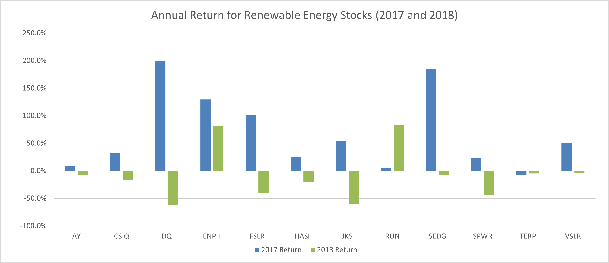
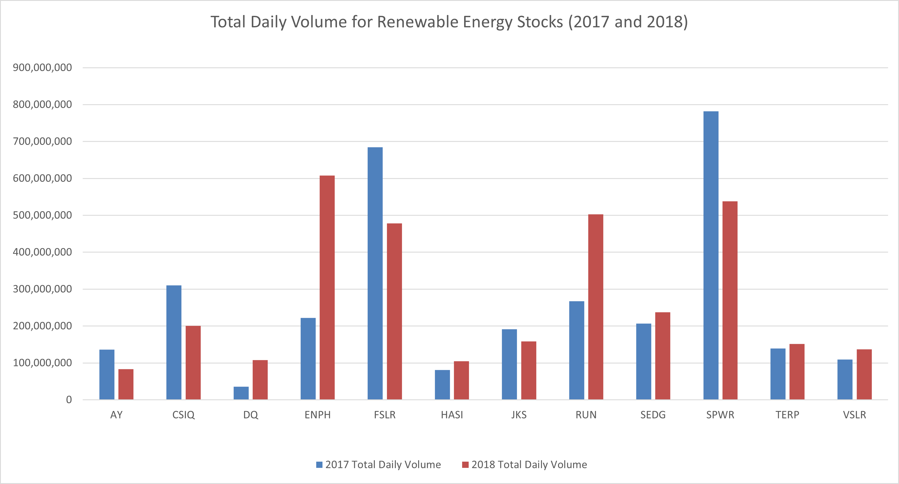
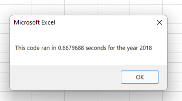
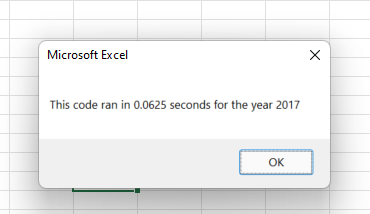
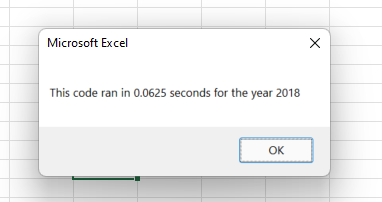
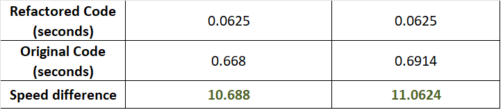

# Stock Analysis Using Excel VBA

## You asked for me to prepare VBA code to expand our analysis from just selected renewable energy stocks to the entire stock market. For this analysis, I refactored my original code to make it run faster, so that it can efficiently analyze any number of stocks and provide you with the Total Daily Volume and Annual Return for each stock. It also allows you to quickly analyze data for different years. With this information, you can make informed decisions to diversity your parents stock portfolio. 


# Results 

## Stock Performance in 2017 and 2018

Overall, the selected renewable energy stocks performed much better in 2017 than 2018, as depicted in the graph below.



In 2017, most of the stocks had a positive annual return, with several stocks nearing 200% - DAQO New Energy Corp (DQ) at 199.4% and SolarEdge Technologies (SEDG) at 184.5%. Only Terraform Power (TERP) had a negative annual return, at -7.2%. 

In 2018, most of the stocks had a negative annual return, with only two stocks performing positively - Enphase Energy (ENPH) at 81.9% and Sunrun (RUN) at 84.0%.

The total daily volume for each stock fluctuated between the two years with no discernable pattern, as depicted in the graph below. The overall total daily volume for all the renewable energy stocks is about the same in 2017 and 2018 (approximately 3 trillion shares), indicating that interest in trading this stocks is stable.



## Script Execution Time

The stock analysis code was refactored to produce the same results in a simpler and more efficient way. The refactored code performs about 10 times faster than the original code. The code also times itself and reports the execution time to the user. Below are the message boxes for the original code for each year: 




And the message boxes for the refactored code for each year:





The original code needs to examine each line of the data worksheet 12 times, once for each of the 12 tickers. Using j as a counter for loop, the logic requires that each line be checked to see if the value in the ticker column is equal to the value of the current ticker for each of the three if statements. The actual ticker is modified outside of this for loop. 

```

'(5) Loop through rows in the data
    Sheets(yearValue).Activate
        For j = rowStart To rowEnd
        
        '(5a) Get total volume for current ticker
            If Cells(j, 1).Value = ticker Then
            totalVolume = totalVolume + Cells(j, 8).Value
            End If
        
    
        '(5b) get starting price for current ticker
            If Cells(j - 1, 1).Value <> ticker And Cells(j, 1).Value = ticker Then
            startingPrice = Cells(j, 6).Value
            End If
            
        '(5c) get ending price for current ticker
            If Cells(j + 1, 1).Value <> ticker And Cells(j, 1).Value = ticker Then
            endingPrice = Cells(j, 6).Value
            End If
            
        Next j
```

The refactored code only analyzes each line once, detecting when data for a new ticker has been reach or data for the previous ticker is complete, and extracting the needed information to an array. The actual ticker is modified within the for loop, such that the entire for loop does not need to be examined for each ticker

```

'2b) Loop over all the rows in the spreadsheet.
    For i = 2 To RowCount
    
    
        '3a) Increase volume for current ticker
        tickerVolumes(tickerIndex) = tickerVolumes(tickerIndex) + Cells(i, 8).Value
        
        '3b) Check if the current row is the first row with the selected tickerIndex.
        If Cells(i - 1, 1).Value <> tickers(tickerIndex) Then
            tickerStartingPrices(tickerIndex) = Cells(i, 6).Value
            
            
        End If
        
        '3c) check if the current row is the last row with the selected ticker
        If Cells(i + 1, 1).Value <> tickers(tickerIndex) Then
            tickerEndingPrices(tickerIndex) = Cells(i, 6).Value
        End If
        
        'If the next row’s ticker doesn’t match, increase the tickerIndex.
        If Cells(i + 1, 1).Value <> tickers(tickerIndex) Then
        
        '3d Increase the tickerIndex.
        tickerIndex = tickerIndex + 1
        End If

```

As we expand to the entire stock market, this difference will be exacerbated, and the refactored code will be much more efficient. See below for a table summary of the script execution time. 



# Summary

## Advantages and Disadvantages of Refactoring Code

The most obvious advantage of refactoring code is that it can result in faster, more efficient, and more generalizable code. Refactored code is often simpler, shorter, and modular, allowing it to applied to larger data sets or other similar problems with few changes. It can also be easier to read and understand, with each important function separated out. 

Refactoring code does have some disadvantages. The process is time-consuming and may not be successful, making it risky for time-sensitive projects. It can require a significant amount of debugging, expertise, and testing. 

## Advantages and Disadvantages of Refactoring the VBA Stock Analysis Script

As discussed above, the refactored stock analysis script code has the following advantages: 
* It runs almost 10 times faster.
* It examines the entire worksheet only once, modifying the ticker being examined within the for loop.
* It is simpler and easier to read and understand.
* It can be easily generalized to the entire stock market efficiently.

Refactoring the code had the following disadvantages:
* It was time and effort consuming, with a single mistake taking over an hour to uncover.
* The original code was already stable and successful for the function it was written for, so refactoring may not have been necessary.


